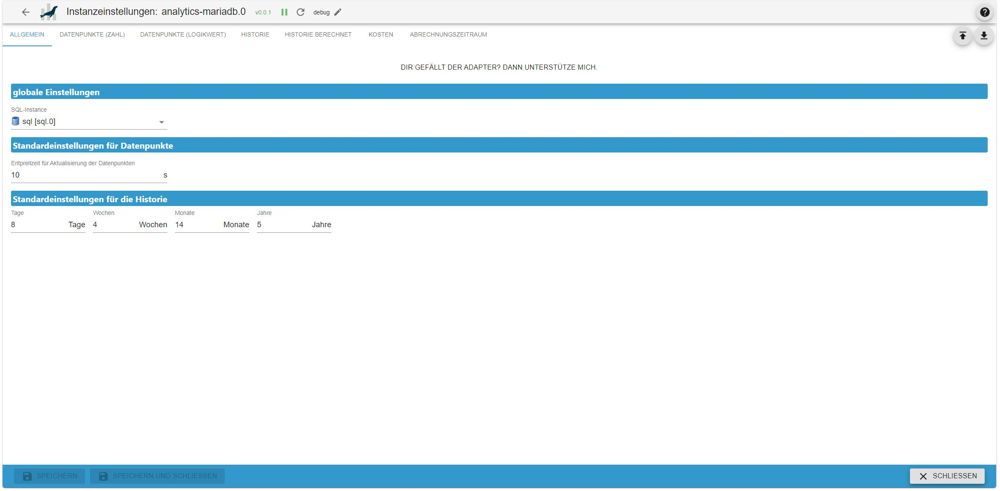
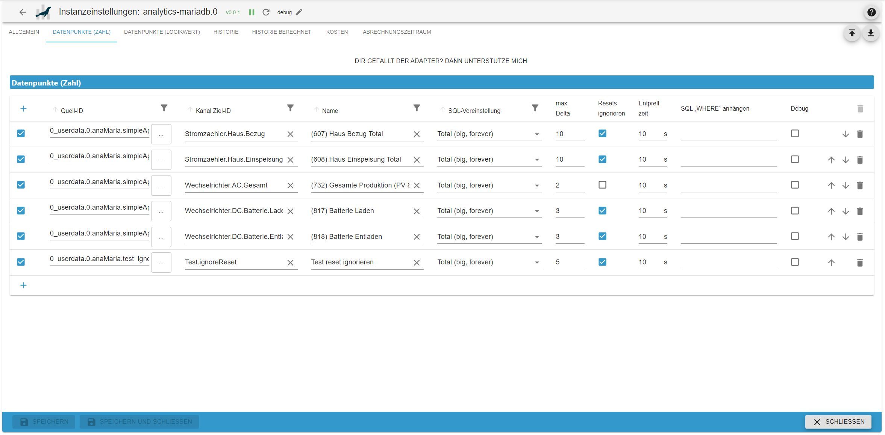
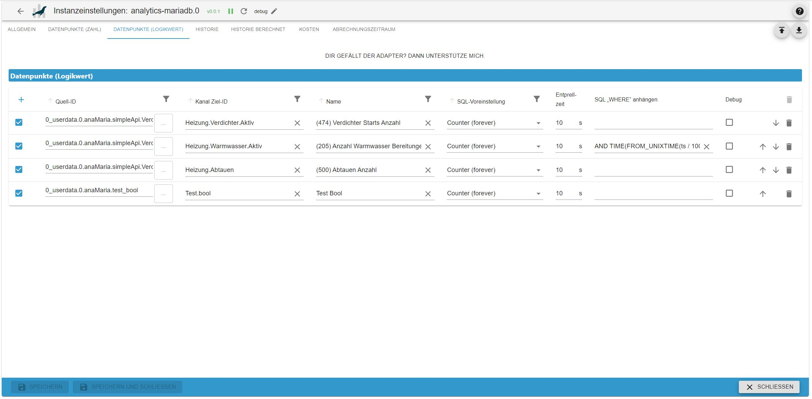
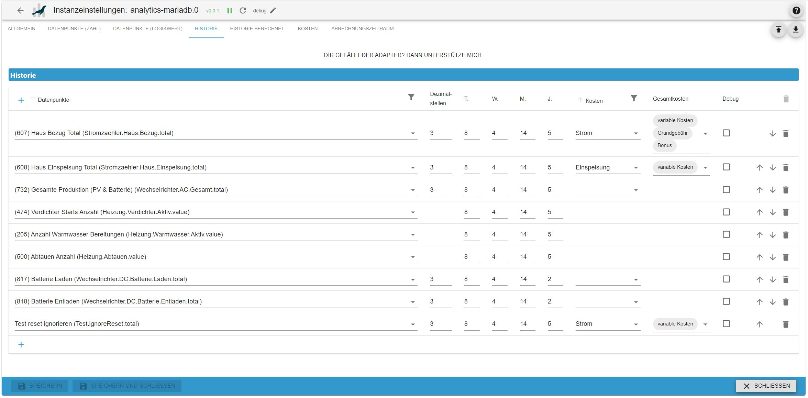
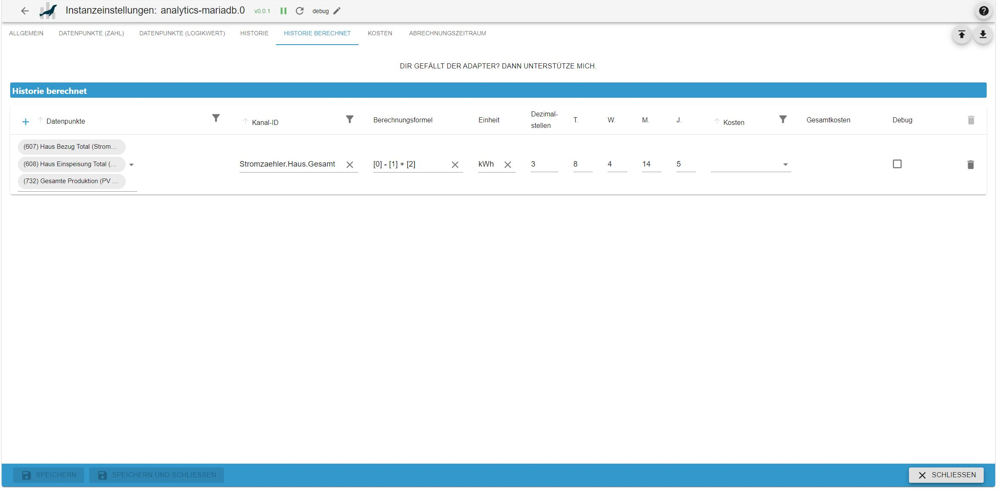
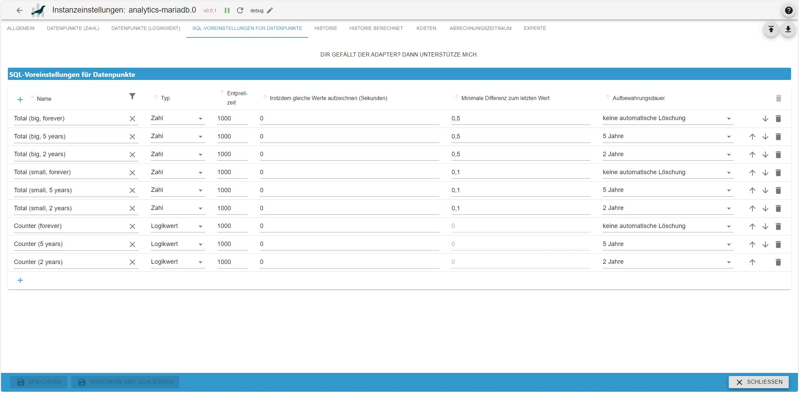

# ioBroker.analytics-mariadb

**Tests:** 

## analytics-mariadb adapter for ioBroker

Analytics adapter for processing data stored in MariaDB

## Derzeit unterstützte Version von MariaDB

Version **10.11.x**

## Adapter Konfiguration

### Allgemein

### Datenpunkte (Zahl)

Hier werden Datenpunkte (vom Typ `number`) von Sensoren die euren Verbrauch messen (z.B. Stromzähler, Wasserzähler, Wärmemengenzähler etc.) hinterlegt, aus denen der Adapter den kumulierten Gesamtverbrauch aufzeichnet und in der Datenbank speichert

| **Spalte**               | **Beschreibung**                                                                                                                                                                                                                                          |
| ------------------------ | --------------------------------------------------------------------------------------------------------------------------------------------------------------------------------------------------------------------------------------------------------- |
| **Quell-ID**             | Datenpunkt zur Verbrauchsmessung vom Typ `number`.                                                                                                                                                                                                        |
| **Kanal Ziel-ID**        | Kanal-ID, unter der alle Daten des Adapters gespeichert werden (z. B. `analytics-mariadb.X.XXX`).                                                                                                                                                         |
| **Name**                 | Ein frei wählbarer Name bzw. eine Bezeichnung für den Datenpunkt.                                                                                                                                                                                         |
| **SQL-Voreinstellung**   | Zu verwendende SQL-Voreinstellungen. Details dazu finden sich unter [SQL-Voreinstellungen für Datenpunkte (Experte)](#SQL-Voreinstellungen-für-Datenpunkte-%28Experte%29).                                                                                |
| **max. Delta**           | Maximales erlaubtes Delta zwischen dem alten und dem neuen Wert. Überschreitet der Wert dieses Delta, wird er ignoriert. Diese Einstellung hilft, kurzfristige Schwankungen (z. B. durch Skalierungsfaktoren) abzufangen.                                 |
| **Resets ignorieren**    | Ein Reset des Zählers wird ignoriert, wenn der neue Wert niedriger ist als der alte. Diese Einstellung verhindert, dass kurzzeitige Sprünge (z. B. durch Skalierungsfaktoren oder Verbindungsabbrüche bei Sensoren) fälschlicherweise registriert werden. |
| **Entprellzeit**         | Wartezeit, bevor ein neuer Wert gespeichert wird. Wenn viele Zähler in kurzen Intervallen (z. B. alle 2–3 Sekunden) Werte senden, empfiehlt es sich, eine Entprellzeit einzurichten, um die Systemressourcen zu schonen.                                  |
| **SQL „WHERE“ anhängen** | SQL-„WHERE“-Bedingung an Datenbankabfragen anhängen (nur verwenden, wenn man sich mit SQL auskennt!).                                                                                                                                                     |
| **Debug**                | Aktiviert zusätzliche Debug-Logs für diesen Datenpunkt. Der Adapter muss hierfür auf das Log-Level „Debug“ gesetzt sein.                                                                                                                                  |

### Datenpunkte (Logikwert)

Hier werden Datenpunkte (vom Typ `boolean`) hinterlegt, aus denen der Adapter die steigenden Flanken zählt (Wert geht von false auf true), als Summe zur Verfügung stellt und in der Datenbank speichert

| **Spalte**               | **Beschreibung**                                                                                                                                                                                                         |
| ------------------------ | ------------------------------------------------------------------------------------------------------------------------------------------------------------------------------------------------------------------------ |
| **Quell-ID**             | Datenpunkt vom Typ `boolean`, der gezählt werden soll.                                                                                                                                                                   |
| **Kanal Ziel-ID**        | Kanal-ID, unter der alle Daten des Adapters gespeichert werden (z. B. `analytics-mariadb.X.XXX`).                                                                                                                        |
| **Name**                 | Ein frei wählbarer Name bzw. eine Bezeichnung für den Datenpunkt.                                                                                                                                                        |
| **SQL-Voreinstellung**   | Zu verwendende SQL-Voreinstellungen. Details dazu finden sich unter [SQL-Voreinstellungen für Datenpunkte (Experte)](#SQL-Voreinstellungen-für-Datenpunkte-%28Experte%29).                                               |
| **Entprellzeit**         | Wartezeit, bevor ein neuer Wert gespeichert wird. Wenn viele Zähler in kurzen Intervallen (z. B. alle 2–3 Sekunden) Werte senden, empfiehlt es sich, eine Entprellzeit einzurichten, um die Systemressourcen zu schonen. |
| **SQL „WHERE“ anhängen** | SQL-„WHERE“-Bedingung an Datenbankabfragen anhängen (nur verwenden, wenn man sich mit SQL auskennt!).                                                                                                                    |
| **Debug**                | Aktiviert zusätzliche Debug-Logs für diesen Datenpunkt. Der Adapter muss hierfür auf das Log-Level „Debug“ gesetzt sein.                                                                                                 |

### Historie

| Spalte          | Beschreibung |
| --------------- | ------------ |
| Datenpunkte     |              |
| Dezimal-stellen |              |
| T.              |              |
| W.              |              |
| M.              |              |
| J.              |              |
| Kosten          |              |
| Gesamtkosten    |              |
| Debug           |              |

### Historie berechnet

| Spalte            | Beschreibung |
| ----------------- | ------------ |
| Datenpunkte       |              |
| Kanal-ID          |              |
| Berechnungsformel |              |
| Einheit           |              |
| Dezimal-stellen   |              |
| T.                |              |
| W.                |              |
| M.                |              |
| J.                |              |
| Kosten            |              |
| Gesamtkosten      |              |
| Debug             |              |

### Kosten

### Abrechnungszeitraum

### SQL-Voreinstellungen für Datenpunkte (Experte)

| Spalte                                        | Beschreibung |
| --------------------------------------------- | ------------ |
| Name                                          |              |
| Typ                                           |              |
| Entprell-zeit                                 |              |
| trotzdem gleiche Werte aufzeichnen (Sekunden) |              |
| Minimale Differenz zum letzten Wert           |              |
| Aufbewahrungsdauer                            |              |

## Changelog

<!--
    Placeholder for the next version (at the beginning of the line):
    ### **WORK IN PROGRESS**
-->

### **WORK IN PROGRESS**

- (Scrounger) initial release

## License

MIT License

Copyright (c) 2026 Scrounger <scrounger@gmx.net>

Permission is hereby granted, free of charge, to any person obtaining a copy
of this software and associated documentation files (the "Software"), to deal
in the Software without restriction, including without limitation the rights
to use, copy, modify, merge, publish, distribute, sublicense, and/or sell
copies of the Software, and to permit persons to whom the Software is
furnished to do so, subject to the following conditions:

The above copyright notice and this permission notice shall be included in all
copies or substantial portions of the Software.

THE SOFTWARE IS PROVIDED "AS IS", WITHOUT WARRANTY OF ANY KIND, EXPRESS OR
IMPLIED, INCLUDING BUT NOT LIMITED TO THE WARRANTIES OF MERCHANTABILITY,
FITNESS FOR A PARTICULAR PURPOSE AND NONINFRINGEMENT. IN NO EVENT SHALL THE
AUTHORS OR COPYRIGHT HOLDERS BE LIABLE FOR ANY CLAIM, DAMAGES OR OTHER
LIABILITY, WHETHER IN AN ACTION OF CONTRACT, TORT OR OTHERWISE, ARISING FROM,
OUT OF OR IN CONNECTION WITH THE SOFTWARE OR THE USE OR OTHER DEALINGS IN THE
SOFTWARE.
